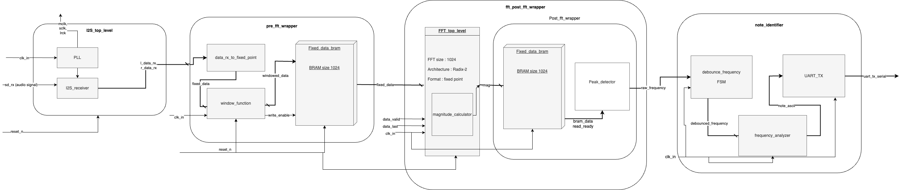

# FPGA Guitar Tuner Project

## Overview
This project involves designing a guitar tuner using an Artix-7 FPGA from Xilinx. The tuner processes 24-bit, 48 kHz stereo audio input, performs Fast Fourier Transform (FFT) to analyze frequencies, and identifies the note being played. The results are then transmitted via UART to a terminal in ASCII code to indicate the detected note. This project was developed from scratch by me, demonstrating the use of various FPGA components and techniques.

## Block Diagram

## Sub-Project: I2S Demo
This sub-project focuses on analyzing the audio signal using I2S BRAM and transmitting the audio signal over UART. The captured data are then fetched and plotted using MATLAB code to visualize the audio signals. For more information about this sub-project, [click here]([#](https://github.com/dannydyl/FPGA-i2s-demo)).

## Project Description

### I2S Top-Level Module (`i2s_toplevel`)
The `i2s_toplevel` module interfaces with the I2S audio input, capturing 24-bit, 48 kHz stereo audio data. This module handles the following:
- **Clock Management**: Uses a Phase-Locked Loop (PLL) (`clk_wiz_0`) to generate the I2S master and channel clocks.
- **Data Handling**: Captures left and right channel audio data and prepares it for further processing using the I2S transceiver (`i2s_receiver`).

### Pre-FFT Wrapper (`pre_fft_wrapper`)
The `pre_fft_wrapper` module prepares the captured audio data for FFT analysis. This includes:
- **Data Conversion**: Converts the audio signal into fixed-point format Q1.15 using the data conversion module (`data_rx_to_fixed_point`).
- **Window Function**: Applies a Hann window function to tailor the sampling using the window function module (`window_function`).
- **Data Storage**: Stores the processed data in Block RAM (BRAM) using the fixed data BRAM module (`fixed_data_bram`) before FFT processing.

### FFT Post-FFT Wrapper (`fft_post_fft_wrapper_DUT`)
The `fft_post_fft_wrapper_DUT` module performs a radix-2 FFT on the prepared audio data and identifies the peak frequency. Key functions include:
- **FFT Processing**: Performs FFT using an AXI stream protocol with an FFT size of 1024 points. This is handled by the FFT IP core (`xfft_0`).
- **Magnitude Calculation**: Calculates the magnitude of the frequency components using the peak detector module (`peak_detector`).
- **Data Storage**: Stores the data and magnitudes in BRAM both pre- and post-FFT using the post FFT BRAM module (`post_fft_bram`).

### Note Identifier (`note_identifier`)
The `note_identifier` module converts the peak frequency to a musical note and transmits the result via UART. This includes:
- **Frequency to Note Conversion**: Converts the peak frequency into the corresponding musical note using the frequency analyzer module (`freq_analyzer`).
- **UART Transmission**: Transmits the detected note as ASCII code over UART using the UART transmission module (`UART_TX`).

### Verification
To ensure the correctness of the design, the following verification methods were used:
- **DUT/Testbench**: Developed and used DUT/testbenches for verifying all entities.
  - `i2s_toplevel`
  - `pre_fft_wrapper`
  - `fft_post_fft_wrapper_DUT`
  - `note_identifier`
- **Integrated Logic Analyzer (ILA)**: Employed ILA for verifying the internal signals and data flow throughout the design.

## Timing Analysis
Timing analysis was performed using Xilinx Vivado, and the design meets all specified timing constraints. Key metrics include:
- **Worst Negative Slack (WNS)**: 5.212 ns
- **Total Negative Slack (TNS)**: 0.000 ns
- **Worst Hold Slack (WHS)**: 0.063 ns
- **Total Hold Slack (THS)**: 0.000 ns
- **Worst Pulse Width Slack (WPWS)**: 3.000 ns
- **Total Pulse Width Negative Slack (TPWS)**: 0.000 ns

All user-specified timing constraints are met, with no setup, hold, or pulse width violations.

## Conclusion
The FPGA Guitar Tuner project successfully integrates multiple modules to process audio input, perform FFT analysis, identify musical notes, and transmit the results via UART in ASCII code. The design meets all specified timing constraints, ensuring reliable operation at the intended clock frequency. The use of BRAM for data storage, Hann window function, radix-2 FFT, AXI stream, and fixed-point format ensures efficient and accurate processing. All components were verified using DUT/testbenches, and internal signal verification was performed using the Integrated Logic Analyzer (ILA).

## License
This project is licensed under the MIT License.
